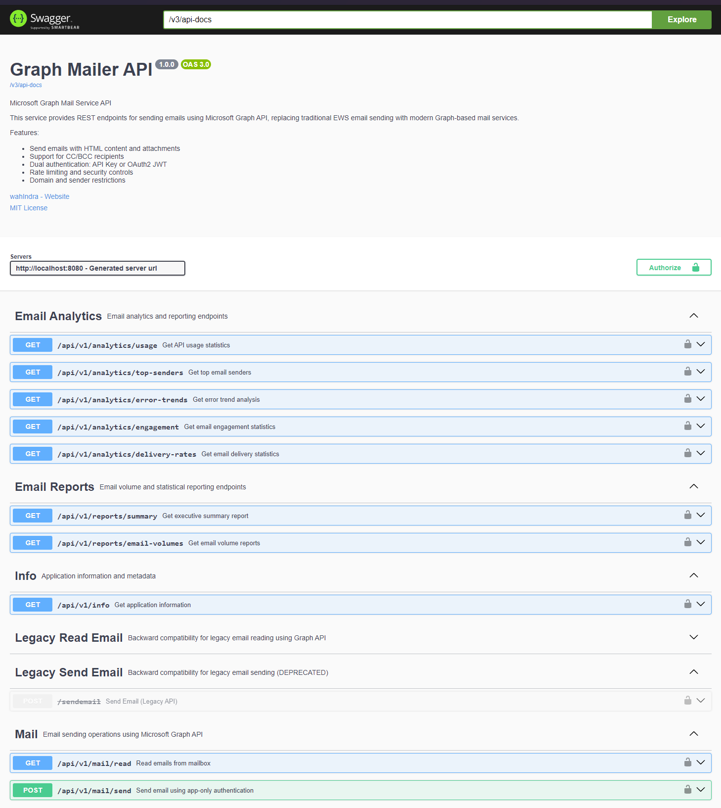

# Graph Mailer

Microsoft Graph Mail Service - A Spring Boot 3 microservice that replaces EWS email sending with Microsoft Graph API.


## Overview

Graph Mailer is a production-grade Spring Boot application that provides REST APIs for sending emails using Microsoft Graph API with Mail.Send application permission. The service supports both internal and external email delivery with comprehensive security, validation, and monitoring features.

### Why Microsoft Graph?

**EWS (Exchange Web Services) Deprecation Notice:**

> Microsoft announced that Exchange Web Services (EWS) will be deprecated and eventually retired. Microsoft strongly recommends migrating to Microsoft Graph API for all email operations.
>
> - **EWS Deprecation Timeline**: [Microsoft Official Announcement](https://techcommunity.microsoft.com/t5/exchange-team-blog/retirement-of-exchange-web-services-in-exchange-online/ba-p/3924440)
> - **Migration Guide**: [EWS to Graph Migration](https://docs.microsoft.com/en-us/graph/migrate-exchange-web-services-overview)

**Microsoft Graph Benefits:**

- **Modern REST API** - Clean, consistent, and well-documented
- **Better Performance** - Optimized for cloud-scale operations
- **Enhanced Security** - OAuth 2.0 and modern authentication
- **Future-Proof** - Actively developed and supported by Microsoft
- **Unified API** - Access to entire Microsoft 365 ecosystem

## Features

- **Microsoft Graph Integration** - Native Graph API with retry logic and error handling
- **Dual Authentication** - API Key or OAuth2 JWT token support
- **Email Capabilities** - HTML content, attachments (up to 5MB), CC/BCC recipients
- **Security Hardening** - Domain restrictions, sender validation, rate limiting
- **Observability** - Structured JSON logging, audit trails, health checks
- **Analytics & Reporting** - Comprehensive email analytics, delivery statistics, engagement metrics
- **Cloud Ready** - Containerized with Kubernetes manifests and CI/CD pipeline
- **API Documentation** - OpenAPI 3.0 with Swagger UI
- **Legacy Compatibility** - Backward compatible endpoints for seamless migration
- **Mock Mode** - Local development without Azure dependencies

## Advanced Features & Future Enhancements

### **Current Advanced Features**

- **Circuit Breaker Pattern** - Resilient Graph API calls with fallback mechanisms
- **Retry Logic** - Exponential backoff for transient failures (429, 5xx responses)
- **Rate Limiting** - Token bucket algorithm with configurable limits per IP/user
- **Request Correlation** - UUID-based tracing across distributed systems
- **Input Sanitization** - XSS protection and email content validation
- **Audit Logging** - Comprehensive audit trail without PII exposure
- **Health Probes** - Kubernetes-ready readiness and liveness checks
- **Multi-Environment Config** - Profile-based configuration (dev/staging/prod)
- **Analytics Engine** - Real-time email delivery tracking, engagement metrics, error analysis
- **Reporting Dashboard** - Executive summaries, volume reports, trend analysis

### **Enterprise-Ready Extensions (Future)**

#### **Email Management APIs**

```bash
# Advanced email operations
GET    /api/v1/mail/folders                    # List mail folders
GET    /api/v1/mail/folders/{id}/messages      # Get messages from specific folder
POST   /api/v1/mail/folders                    # Create custom folders
DELETE /api/v1/mail/messages/{id}              # Delete specific message
PATCH  /api/v1/mail/messages/{id}              # Update message (mark read/unread)
POST   /api/v1/mail/messages/{id}/forward      # Forward message
POST   /api/v1/mail/messages/{id}/reply        # Reply to message
```

#### **Calendar Integration**

```bash
# Meeting and calendar operations
GET    /api/v1/calendar/events                 # List calendar events
POST   /api/v1/calendar/events                 # Create meeting with email invites
POST   /api/v1/calendar/events/{id}/invite     # Send meeting invitations
GET    /api/v1/calendar/availability           # Check user availability
```

#### **Contact Management**

```bash
# Contact and distribution list operations
GET    /api/v1/contacts                        # List contacts
POST   /api/v1/contacts/groups                 # Create distribution lists
GET    /api/v1/contacts/groups/{id}/members    # Get group members
POST   /api/v1/mail/send/bulk                  # Bulk email to distribution lists
```

#### **Advanced Security & Compliance**

```bash
# Security and compliance features
POST   /api/v1/mail/dlp/scan                   # Data Loss Prevention scanning
GET    /api/v1/mail/audit/trail                # Compliance audit trails
POST   /api/v1/mail/quarantine                 # Quarantine suspicious emails
GET    /api/v1/mail/threats                    # Security threat analysis
```

#### **Analytics & Reporting** ✅ **IMPLEMENTED**

```bash
# Email analytics and insights - WORKING ENDPOINTS
GET    /api/v1/analytics/delivery-rates        # Email delivery statistics
GET    /api/v1/analytics/engagement            # Open/click rates and user engagement metrics
GET    /api/v1/analytics/usage                 # API usage statistics and trends
GET    /api/v1/analytics/top-senders           # Top email senders by volume
GET    /api/v1/analytics/error-trends          # Error patterns and trend analysis
GET    /api/v1/reports/email-volumes           # Volume reports by domain/user/time
GET    /api/v1/reports/summary                 # Executive summary with KPIs
```

#### **Workflow & Automation**

```bash
# Email workflow automation
POST   /api/v1/workflows/rules                 # Create email rules
GET    /api/v1/workflows/templates             # Email templates management
POST   /api/v1/workflows/schedules             # Schedule email campaigns
POST   /api/v1/workflows/triggers              # Event-driven email triggers
```

### **Technical Enhancements (Roadmap)**

#### **Performance & Scalability**

- **Redis Caching** - Cache Graph API responses and rate limit counters
- **Message Queuing** - Asynchronous email processing with RabbitMQ/Azure Service Bus
- **Load Balancing** - Horizontal scaling with session affinity
- **Auto-scaling** - Kubernetes HPA based on CPU/memory/custom metrics
- **Database Integration** - Email tracking and audit storage (PostgreSQL/MongoDB)

#### **Monitoring & Observability**

- **Prometheus Metrics** - Custom business metrics (emails sent, success rates)
- **Grafana Dashboards** - Visual monitoring and alerting
- **Distributed Tracing** - Jaeger/Zipkin integration for request flows
- **Mobile Alerting** - PagerDuty/Slack integration for critical issues
- **Smart Alerts** - ML-based anomaly detection for email patterns

#### **Security Hardening**

- **mTLS Support** - Mutual TLS for service-to-service communication
- **WAF Integration** - Web Application Firewall protection
- **Vault Integration** - HashiCorp Vault for secrets management
- **Vulnerability Scanning** - Continuous security scanning (Snyk, OWASP)
- **Compliance Reports** - SOC2, ISO27001 compliance automation

#### **Developer Experience**

- **Test Automation** - Contract testing with Pact, performance testing
- **SDK Generation** - Auto-generated client SDKs (.NET, Python, JavaScript)
- **Developer Portal** - Self-service API documentation and testing
- **Interactive Docs** - Runnable examples in documentation
- **Mock Servers** - Realistic mock servers for external dependencies

### **Integration Patterns**

#### **Enterprise Service Bus**

```yaml
# Message-driven architecture
email:
  events:
    - email.sent
    - email.delivered
    - email.bounced
    - email.opened
  integrations:
    - salesforce
    - dynamics365
    - servicenow
    - slack
```

#### **Webhook Notifications**

```bash
# Real-time event notifications
POST   /api/v1/webhooks/subscriptions         # Subscribe to email events
DELETE /api/v1/webhooks/subscriptions/{id}    # Unsubscribe from events
GET    /api/v1/webhooks/events                # List webhook events
```

#### **Multi-Tenant Support**

```bash
# Tenant isolation and management
GET    /api/v1/tenants                        # List tenants
POST   /api/v1/tenants                        # Create new tenant
GET    /api/v1/tenants/{id}/settings          # Tenant-specific configuration
POST   /api/v1/tenants/{id}/mail/send         # Tenant-scoped email sending
```

## Quick Start

### Prerequisites

- Java 21+ (OpenJDK or Eclipse Temurin recommended)
- Maven 3.8+
- Microsoft Graph application registration with Mail.Send permission

### Local Development

1. **Clone and build**

   ```bash
   git clone https://github.com/wahIndra/msgraph.git
   cd graph-mailer
   ./mvnw clean verify
   ```

2. **Set environment variables**

   ```bash
   export GRAPH_TENANT_ID=your-tenant-id
   export GRAPH_CLIENT_ID=your-client-id
   export GRAPH_CLIENT_SECRET=your-client-secret
   export GRAPH_MAILER_API_KEY=your-api-key
   ```

3. **Run the application**

   ```bash
   ./mvnw spring-boot:run
   ```

4. **Test the service**

   ```bash
   curl -X POST "http://localhost:8080/api/v1/mail/send" \
     -H "Content-Type: application/json" \
     -H "X-API-Key: your-api-key" \
     -d '{
       "fromUpn": "noreply@yourtenant.com",
       "to": ["test@example.com"],
       "subject": "Test Email",
       "htmlBody": "<p>Hello from Graph Mailer!</p>",
       "saveToSentItems": true
     }'
   ```

5. **Explore analytics & reporting**

   ```bash
   # View delivery statistics
   curl -X GET "http://localhost:8080/api/v1/analytics/delivery-rates?from=2025-10-01&to=2025-10-21" \
     -H "X-API-Key: your-api-key"

   # Get executive summary
   curl -X GET "http://localhost:8080/api/v1/reports/summary?from=2025-10-01&to=2025-10-21" \
     -H "X-API-Key: your-api-key"

   # Access interactive API docs
   open http://localhost:8080/swagger-ui.html
   ```

## Mock Mode (Local Development)

For local development and testing without Azure Graph API credentials, use mock mode:

### Quick Start with Mock Mode

#### Option 1: Using the Start Script (Recommended)

```bash
# 1. Clone and build
git clone https://github.com/wahIndra/msgraph.git
cd graph-mailer
./mvnw clean compile

# 2. Run using the convenient start script
./start-mock.sh

# 3. Application starts on http://localhost:8080
# API Key for mock mode: demo-api-key-12345
```

The `start-mock.sh` script provides:

- **Automated Setup** - Sets all required environment variables
- **Color-coded Output** - Easy to read startup information
- **Error Prevention** - Handles mock credentials automatically
- **No Manual Configuration** - Just run the script and go

#### Option 2: Manual Start

```bash
# 1. Clone and build
git clone https://github.com/wahIndra/msgraph.git
cd graph-mailer
./mvnw clean compile

# 2. Run in mock mode (no Azure credentials needed)
./mvnw exec:java -Dexec.mainClass="com.graphmailer.GraphMailerApplication" \
  -Dexec.args="--spring.profiles.active=mock,dev,api-key"

# 3. Application starts on http://localhost:8080
# API Key for mock mode: demo-api-key-12345
```

### Start Script Details

The `start-mock.sh` script automatically handles:

```bash
# Environment variables set by the script:
export SPRING_PROFILES_ACTIVE=mock
export APP_MODE=mock
export GRAPH_TENANT_ID=mock-tenant-id
export GRAPH_CLIENT_ID=mock-client-id
export GRAPH_CLIENT_SECRET=mock-client-secret
export GRAPH_MAILER_API_KEY=demo-api-key-12345
export SERVER_PORT=8080

# Then runs: mvn spring-boot:run -Dmaven.test.skip=true -Dspring-boot.run.profiles=mock
```

**Sample Output:**

```
======================================
  Graph Mailer - Mock Mode Startup
======================================

Setting up mock environment...
✓ Mock mode enabled
✓ Graph Tenant ID: mock-tenant-id
✓ API Key: demo-api-key-12345
✓ Server Port: 8080

Starting Graph Mailer in mock mode...
Note: No real emails will be sent!
```

### Mock Mode Features

- **No Azure Setup Required** - Works offline without Graph API credentials
- **Realistic Test Data** - Generates mock emails with proper structure
- **Both API Endpoints** - Legacy and modern APIs work identically
- **Full Functionality** - All features work except actual email sending/reading
- **Swagger UI Available** - Complete API documentation at `/swagger-ui.html`

### Testing Both API Styles

#### Modern REST API (Recommended)

**Read Emails:**

```bash
curl -X GET "http://localhost:8080/api/v1/mail/read?mailbox=john.doe@example.com&sender=sender@example.com&subject=Important&top=10&format=json" \
  -H "X-API-Key: demo-api-key-12345" \
  -H "Accept: application/json"
```

**Send Email:**

```bash
curl -X POST "http://localhost:8080/api/v1/mail/send" \
  -H "Content-Type: application/json" \
  -H "X-API-Key: demo-api-key-12345" \
  -d '{
    "fromUpn": "noreply@test.com",
    "to": ["recipient@example.com"],
    "subject": "Test Email",
    "htmlBody": "<p>Hello from Graph Mailer Mock!</p>"
  }'
```

#### Legacy API (Backward Compatibility)

**Read Emails:**

```bash
curl -X POST "http://localhost:8080/reademail" \
  -H "X-API-Key: demo-api-key-12345" \
  -d "from=john.doe@example.com&paswd=dummy&subject=Important&sender=sender@example.com&counted=5&filetype=JSON&separator=,&header=true&filename=emails.json"
```

**Send Email:**

```bash
curl -X POST "http://localhost:8080/sendemail" \
  -H "X-API-Key: demo-api-key-12345" \
  -d "from=test@example.com&to=recipient@example.com&subject=Test&msgbody=Hello"
```

### Mock Response Examples

**Modern API Response:**

```json
{
  "emails": [
    {
      "receivedDateTime": "2025-10-21T09:00:00Z",
      "subject": "Important Mock Email 1",
      "isRead": false,
      "messageId": "mock-msg-1",
      "bodyPreview": "This is a mock email body preview for testing purposes",
      "from": "sender@example.com",
      "hasAttachments": false
    }
  ],
  "note": "MOCK DATA - Real emails would be retrieved from Microsoft Graph API",
  "mailbox": "john.doe@example.com",
  "totalCount": 10,
  "status": "SUCCESS"
}
```

**Legacy API Response:**

```json
{
  "status": "SUCCESS",
  "messageId": "mock-12345",
  "timestamp": "2025-10-21T08:00:00Z",
  "message": "Email sent successfully (MOCK MODE)",
  "correlationId": "mock-correlation-id"
}
```

### Mock Configuration

Mock mode uses these settings (`application-mock.yml`):

```yaml
# Mock mode configuration
app:
  mode: mock

security:
  inbound:
    api-key-value: demo-api-key-12345

mail:
  allowed-recipient-domains:
    - "example.com"
    - "test.com"
    - "localhost"
```

### Switching to Production

When ready for production, change the profile and set real environment variables:

```bash
# Production mode with real Azure credentials
export GRAPH_TENANT_ID=your-real-tenant-id
export GRAPH_CLIENT_ID=your-real-client-id
export GRAPH_CLIENT_SECRET=your-real-client-secret
export GRAPH_MAILER_API_KEY=your-real-api-key

./mvnw spring-boot:run --spring.profiles.active=prod,api-key
```

### API Documentation

Once running, access the interactive API documentation:

- **Swagger UI**: http://localhost:8080/swagger-ui.html
- **OpenAPI JSON**: http://localhost:8080/v3/api-docs

### Quick Test Script

Create a test script to verify all functionality:

```bash
#!/bin/bash
# test-graph-mailer.sh

BASE_URL="http://localhost:8080"
API_KEY="demo-api-key-12345"

echo "Testing Graph Mailer APIs..."

# Test 1: Health Check
echo "1️⃣ Health Check:"
curl -s "$BASE_URL/actuator/health" | jq .

# Test 2: Modern Read API
echo -e "\n2️⃣ Modern Read API:"
curl -s -X GET "$BASE_URL/api/v1/mail/read?mailbox=test@example.com&top=3&format=json" \
  -H "X-API-Key: $API_KEY" | jq .

# Test 3: Modern Send API
echo -e "\n3️⃣ Modern Send API:"
curl -s -X POST "$BASE_URL/api/v1/mail/send" \
  -H "Content-Type: application/json" \
  -H "X-API-Key: $API_KEY" \
  -d '{
    "fromUpn": "test@example.com",
    "to": ["recipient@example.com"],
    "subject": "Modern API Test",
    "htmlBody": "<p>Test from modern API</p>"
  }' | jq .

# Test 4: Legacy Read API
echo -e "\n4️⃣ Legacy Read API:"
curl -s -X POST "$BASE_URL/reademail" \
  -H "X-API-Key: $API_KEY" \
  -d "from=test@example.com&paswd=dummy&subject=test&counted=3&filetype=JSON&separator=,&header=true&filename=emails.json" | jq .

# Test 5: Legacy Send API
echo -e "\n5️⃣ Legacy Send API:"
curl -s -X POST "$BASE_URL/sendemail" \
  -H "X-API-Key: $API_KEY" \
  -d "from=test@example.com&to=recipient@example.com&subject=Legacy API Test&msgbody=Test from legacy API" | jq .

echo -e "\nAll tests completed!"
```

Make it executable and run:

```bash
chmod +x test-graph-mailer.sh
./test-graph-mailer.sh
```

### Testing Analytics Endpoints

The analytics system provides comprehensive email insights and reporting. Test all analytics endpoints:

```bash
# Test all analytics endpoints
chmod +x test-analytics-endpoints.sh
./test-analytics-endpoints.sh
```

**Sample Analytics Tests:**

```bash
#!/bin/bash
BASE_URL="http://localhost:8080"
API_KEY="demo-api-key-12345"

# Test delivery rate analytics
curl -s -X GET "$BASE_URL/api/v1/analytics/delivery-rates?from=2025-10-01&to=2025-10-21&domain=example.com" \
  -H "X-API-Key: $API_KEY" | jq .

# Test engagement metrics
curl -s -X GET "$BASE_URL/api/v1/analytics/engagement?from=2025-10-01&to=2025-10-21&limit=10" \
  -H "X-API-Key: $API_KEY" | jq .

# Test usage statistics
curl -s -X GET "$BASE_URL/api/v1/analytics/usage?from=2025-10-01&to=2025-10-21&groupBy=day" \
  -H "X-API-Key: $API_KEY" | jq .

# Test top senders report
curl -s -X GET "$BASE_URL/api/v1/analytics/top-senders?limit=5&days=7" \
  -H "X-API-Key: $API_KEY" | jq .

# Test error trends analysis
curl -s -X GET "$BASE_URL/api/v1/analytics/error-trends?from=2025-10-01&to=2025-10-21&errorType=authentication" \
  -H "X-API-Key: $API_KEY" | jq .

# Test email volume reports
curl -s -X GET "$BASE_URL/api/v1/reports/email-volumes?from=2025-10-01&to=2025-10-21&groupBy=domain" \
  -H "X-API-Key: $API_KEY" | jq .

# Test executive summary
curl -s -X GET "$BASE_URL/api/v1/reports/summary?from=2025-10-01&to=2025-10-21" \
  -H "X-API-Key: $API_KEY" | jq .
```

**Sample Analytics Response:**

```json
{
  "totalEmails": 1250,
  "delivered": 1186,
  "failed": 64,
  "deliveryRate": 94.88,
  "failureRate": 5.12,
  "dateRange": {
    "from": "2025-10-01",
    "to": "2025-10-21"
  },
  "breakdown": {
    "authenticationErrors": 15,
    "recipientErrors": 28,
    "networkErrors": 12,
    "rateLimitErrors": 9
  },
  "note": "MOCK DATA - Production analytics from Microsoft Graph API",
  "generatedAt": "2025-10-21T10:15:30Z"
}
```

**Analytics Features:**

- **Delivery Statistics**: Success/failure rates, error categorization, trend analysis
- **Engagement Metrics**: Open rates, click-through rates, user interaction patterns
- **Usage Analytics**: API call volume, peak usage times, sender statistics
- **Error Analysis**: Failed delivery patterns, authentication issues, rate limiting
- **Volume Reports**: Email volume by domain, user, time period with flexible grouping
- **Executive Dashboard**: KPI summaries, health scores, comparative metrics

## Microsoft Graph Setup

### Prerequisites

Before setting up the application, familiarize yourself with Microsoft Graph:

- **Microsoft Graph Documentation**: [https://docs.microsoft.com/graph/](https://docs.microsoft.com/graph/)
- **Graph Explorer (Interactive Testing)**: [https://developer.microsoft.com/graph/graph-explorer](https://developer.microsoft.com/graph/graph-explorer)
- **Mail API Reference**: [https://docs.microsoft.com/graph/api/resources/mail-api-overview](https://docs.microsoft.com/graph/api/resources/mail-api-overview)
- **Application Permissions Guide**: [https://docs.microsoft.com/graph/permissions-reference#mail-permissions](https://docs.microsoft.com/graph/permissions-reference#mail-permissions)
- **Quick Start Samples**: [https://docs.microsoft.com/graph/quick-start](https://docs.microsoft.com/graph/quick-start)

### 1. Register Application in Entra ID

1. Go to [Azure Portal](https://portal.azure.com) → Entra ID → App registrations
2. Click "New registration"
3. Name: `graph-mailer`
4. Supported account types: "Accounts in this organizational directory only"
5. Click "Register"

### 2. Configure API Permissions

1. Go to "API permissions" → "Add a permission"
2. Select "Microsoft Graph" → "Application permissions"
3. Add `Mail.Send` permission
4. Click "Grant admin consent"

### 3. Create Client Secret

1. Go to "Certificates & secrets" → "New client secret"
2. Description: `graph-mailer-secret`
3. Expires: Choose appropriate duration
4. Copy the secret value (you won't see it again)

### 4. Note Required Values

- **Tenant ID**: Directory (tenant) ID from app overview
- **Client ID**: Application (client) ID from app overview
- **Client Secret**: The secret value from step 3

## Configuration

### Environment Variables

| Variable               | Description               | Required | Example                                         |
| ---------------------- | ------------------------- | -------- | ----------------------------------------------- |
| `GRAPH_TENANT_ID`      | Entra ID tenant ID        | Yes      | `12345678-1234-1234-1234-123456789012`          |
| `GRAPH_CLIENT_ID`      | Application client ID     | Yes      | `87654321-4321-4321-4321-210987654321`          |
| `GRAPH_CLIENT_SECRET`  | Application client secret | Yes      | `your-secret-value`                             |
| `GRAPH_MAILER_API_KEY` | Inbound API key           | Yes\*    | `your-secure-api-key`                           |
| `JWT_ISSUER_URI`       | OAuth2 JWT issuer         | Yes\*\*  | `https://login.microsoftonline.com/tenant/v2.0` |

\*Required when using API key authentication mode
\*\*Required when using OAuth2 authentication mode

### Configuration Profiles

- **Development**: `dev,api-key` - Debug logging, relaxed validation
- **Production**: `prod,oauth2` - Info logging, strict security
- **API Key Mode**: `api-key` - X-API-Key header authentication
- **OAuth2 Mode**: `oauth2` - JWT Bearer token authentication

### Mail Configuration

```yaml
mail:
  allowed-recipient-domains:
    - "yourtenant.com"
    - "gmail.com"
  allowed-sender-upns:
    - "noreply@yourtenant.com"
    - "system@yourtenant.com"
  max-attachment-bytes: 5242880 # 5MB
```

## API Reference

### Send Email (Application-Only)

**Endpoint**: `POST /api/v1/mail/send`

**Authentication**: API Key (`X-API-Key` header) or OAuth2 JWT

**Request Body**:

```json
{
  "fromUpn": "noreply@yourtenant.com",
  "to": ["recipient@example.com"],
  "cc": ["cc@example.com"],
  "bcc": ["bcc@example.com"],
  "subject": "Subject Line",
  "htmlBody": "<p>HTML content</p>",
  "textBody": "Plain text content",
  "attachments": [
    {
      "filename": "document.pdf",
      "contentType": "application/pdf",
      "base64": "JVBERi0xLjQK..."
    }
  ],
  "saveToSentItems": true,
  "importance": "normal"
}
```

**Response**:

```json
{
  "status": "SUCCESS",
  "messageId": "uuid-1234",
  "timestamp": "2025-10-21T08:00:00Z",
  "message": "Email sent successfully",
  "correlationId": "correlation-uuid"
}
```

### Application Info

**Endpoint**: `GET /api/v1/info`

Returns application metadata including version, build time, and environment.

### Health Check

**Endpoint**: `GET /actuator/health`

Returns application health status for monitoring and load balancers.

### Analytics & Reporting APIs

#### Email Delivery Analytics

**Endpoint**: `GET /api/v1/analytics/delivery-rates`

**Parameters**:

- `from` (required): Start date (YYYY-MM-DD)
- `to` (required): End date (YYYY-MM-DD)
- `domain` (optional): Filter by sender domain
- `tenantId` (optional): Filter by tenant

**Response**:

```json
{
  "totalEmails": 1250,
  "delivered": 1186,
  "failed": 64,
  "deliveryRate": 94.88,
  "failureRate": 5.12,
  "breakdown": {
    "authenticationErrors": 15,
    "recipientErrors": 28,
    "networkErrors": 12,
    "rateLimitErrors": 9
  }
}
```

#### Engagement Metrics

**Endpoint**: `GET /api/v1/analytics/engagement`

**Parameters**:

- `from` (required): Start date
- `to` (required): End date
- `limit` (optional): Maximum results (default: 100)

#### Usage Statistics

**Endpoint**: `GET /api/v1/analytics/usage`

**Parameters**:

- `from` (required): Start date
- `to` (required): End date
- `groupBy` (optional): hour, day, week, month

#### Top Senders Report

**Endpoint**: `GET /api/v1/analytics/top-senders`

**Parameters**:

- `limit` (optional): Number of top senders (default: 10)
- `days` (optional): Days to look back (default: 7)

#### Error Trends Analysis

**Endpoint**: `GET /api/v1/analytics/error-trends`

**Parameters**:

- `from` (required): Start date
- `to` (required): End date
- `errorType` (optional): Filter by error type

#### Email Volume Reports

**Endpoint**: `GET /api/v1/reports/email-volumes`

**Parameters**:

- `from` (required): Start date
- `to` (required): End date
- `groupBy` (optional): domain, user, day, week, month

#### Executive Summary

**Endpoint**: `GET /api/v1/reports/summary`

**Parameters**:

- `from` (required): Start date
- `to` (required): End date
- `includeComparison` (optional): Include period-over-period comparison

**Response**:

```json
{
  "totalEmailsSent": 5420,
  "deliveryRate": 96.2,
  "averageResponseTime": 1.34,
  "healthScore": 92,
  "topIssues": ["Rate limiting", "Invalid recipients"],
  "recommendations": ["Implement retry logic", "Validate email addresses"]
}
```

## Security

### Authentication Modes

**API Key Mode** (Default for development):

```bash
curl -H "X-API-Key: your-api-key" ...
```

**OAuth2 Mode** (Recommended for production):

```bash
curl -H "Authorization: Bearer your-jwt-token" ...
```

### Rate Limiting

- **Default Limit**: 30 requests per minute per IP address
- **Configurable**: Adjust via Bucket4j configuration
- **Response**: HTTP 429 when limit exceeded

### Security Headers

All responses include security headers:

- `X-Content-Type-Options: nosniff`
- `X-Frame-Options: DENY`
- `X-XSS-Protection: 1; mode=block`
- `Content-Security-Policy: default-src 'self'`
- `Strict-Transport-Security` (HTTPS only)

## Deployment

### Docker

**Build image**:

```bash
docker build -t graph-mailer:latest .
```

**Run container**:

```bash
docker run -p 8080:8080 \
  -e GRAPH_TENANT_ID=your-tenant \
  -e GRAPH_CLIENT_ID=your-client \
  -e GRAPH_CLIENT_SECRET=your-secret \
  -e GRAPH_MAILER_API_KEY=your-key \
  graph-mailer:latest
```

### Kubernetes

Apply the provided Kubernetes manifests:

```bash
kubectl apply -f deploy/kubernetes/graph-mailer.yaml
```

Update the secrets with your actual values:

```bash
kubectl create secret generic graph-mailer-secrets \
  --from-literal=graph-tenant-id="your-tenant-id" \
  --from-literal=graph-client-id="your-client-id" \
  --from-literal=graph-client-secret="your-secret" \
  --from-literal=graph-mailer-api-key="your-api-key" \
  -n graph-mailer
```

## Architecture & Best Practices

### **Microservice Design Patterns**

#### **Domain-Driven Design (DDD)**

```java
// Recommended package structure for large-scale systems
com.graphmailer/
├── domain/              # Core business logic
│   ├── mail/           # Mail aggregate
│   ├── calendar/       # Calendar aggregate
│   └── contact/        # Contact aggregate
├── application/        # Application services
│   ├── command/        # CQRS commands
│   ├── query/          # CQRS queries
│   └── handler/        # Command/Query handlers
├── infrastructure/     # External integrations
│   ├── graph/          # Microsoft Graph adapters
│   ├── persistence/    # Database repositories
│   └── messaging/      # Event publishing
└── presentation/       # Controllers and DTOs
```

#### **CQRS (Command Query Responsibility Segregation)**

```java
// Separate read and write models
@RestController
@RequestMapping("/api/v1/mail")
public class MailCommandController {

    @PostMapping("/send")
    public ResponseEntity<CommandResult> sendEmail(@RequestBody SendEmailCommand command) {
        return commandBus.execute(command);
    }
}

@RestController
@RequestMapping("/api/v1/mail/queries")
public class MailQueryController {

    @GetMapping("/inbox")
    public ResponseEntity<EmailList> getInbox(@RequestBody GetInboxQuery query) {
        return queryBus.execute(query);
    }
}
```

#### **Event-Driven Architecture**

```java
// Domain events for system integration
@Component
public class EmailEventPublisher {

    @EventListener
    public void onEmailSent(EmailSentEvent event) {
        // Publish to message bus
        messageBus.publish(event);

        // Update analytics
        analyticsService.recordEmailSent(event);

        // Trigger workflows
        workflowEngine.trigger(event);
    }
}
```

### **Production Readiness Checklist**

#### **Observability Stack**

```yaml
# Recommended monitoring setup
observability:
  metrics:
    - prometheus
    - micrometer
    - custom-business-metrics
  logging:
    - structured-json
    - correlation-ids
    - no-pii-logging
  tracing:
    - opentelemetry
    - jaeger
    - distributed-spans
  alerting:
    - grafana-alerts
    - pagerduty
    - slack-notifications
```

#### **Security Hardening**

```yaml
# Production security configuration
security:
  authentication:
    - oauth2-jwt
    - api-key-rotation
    - mfa-support
  authorization:
    - rbac
    - resource-based-permissions
    - tenant-isolation
  encryption:
    - tls-1.3
    - data-at-rest
    - secrets-management
  compliance:
    - gdpr-ready
    - audit-logging
    - data-retention-policies
```

#### **Performance Optimization**

```yaml
# Performance best practices
performance:
  caching:
    - redis-cluster
    - graph-response-cache
    - rate-limit-cache
  database:
    - connection-pooling
    - read-replicas
    - query-optimization
  messaging:
    - async-processing
    - dead-letter-queues
    - batch-operations
  scaling:
    - horizontal-pod-autoscaler
    - vertical-pod-autoscaler
    - cluster-autoscaler
```

### **Future Controller Examples**

#### **Email Analytics Controller**

```java
@RestController
@RequestMapping("/api/v1/analytics")
public class EmailAnalyticsController {

    @GetMapping("/delivery-rates")
    public ResponseEntity<DeliveryRateReport> getDeliveryRates(
            @RequestParam @DateTimeFormat(iso = DateTimeFormat.ISO.DATE) LocalDate from,
            @RequestParam @DateTimeFormat(iso = DateTimeFormat.ISO.DATE) LocalDate to,
            @RequestParam(required = false) String domain) {
        // Implementation
    }

    @GetMapping("/top-senders")
    public ResponseEntity<List<SenderStats>> getTopSenders(
            @RequestParam(defaultValue = "10") int limit,
            @RequestParam(defaultValue = "7") int days) {
        // Implementation
    }
}
```

#### **Email Template Controller**

```java
@RestController
@RequestMapping("/api/v1/templates")
public class EmailTemplateController {

    @GetMapping
    public ResponseEntity<Page<EmailTemplate>> getTemplates(
            @PageableDefault Pageable pageable,
            @RequestParam(required = false) String category) {
        // Implementation
    }

    @PostMapping
    public ResponseEntity<EmailTemplate> createTemplate(
            @Valid @RequestBody CreateTemplateRequest request) {
        // Implementation
    }

    @PostMapping("/{id}/send")
    public ResponseEntity<SendMailResponse> sendTemplateEmail(
            @PathVariable String id,
            @Valid @RequestBody SendTemplateRequest request) {
        // Implementation
    }
}
```

#### **Email Workflow Controller**

```java
@RestController
@RequestMapping("/api/v1/workflows")
public class EmailWorkflowController {

    @PostMapping("/campaigns")
    public ResponseEntity<Campaign> createCampaign(
            @Valid @RequestBody CreateCampaignRequest request) {
        // Implementation
    }

    @PostMapping("/drip-sequences")
    public ResponseEntity<DripSequence> createDripSequence(
            @Valid @RequestBody CreateDripSequenceRequest request) {
        // Implementation
    }

    @GetMapping("/campaigns/{id}/status")
    public ResponseEntity<CampaignStatus> getCampaignStatus(
            @PathVariable String id) {
        // Implementation
    }
}
```

### **Integration Patterns**

#### **Webhook Management**

```java
@RestController
@RequestMapping("/api/v1/webhooks")
public class WebhookController {

    @PostMapping("/subscriptions")
    public ResponseEntity<WebhookSubscription> subscribe(
            @Valid @RequestBody CreateWebhookRequest request) {
        // Validate URL, set up subscription
    }

    @DeleteMapping("/subscriptions/{id}")
    public ResponseEntity<Void> unsubscribe(@PathVariable String id) {
        // Remove subscription
    }

    @PostMapping("/test")
    public ResponseEntity<WebhookTestResult> testWebhook(
            @Valid @RequestBody TestWebhookRequest request) {
        // Test webhook endpoint
    }
}
```

#### **Multi-Tenant Support**

```java
@RestController
@RequestMapping("/api/v1/tenants")
public class TenantController {

    @PostMapping
    public ResponseEntity<Tenant> createTenant(
            @Valid @RequestBody CreateTenantRequest request) {
        // Tenant onboarding
    }

    @GetMapping("/{tenantId}/settings")
    public ResponseEntity<TenantSettings> getTenantSettings(
            @PathVariable String tenantId) {
        // Tenant-specific configuration
    }

    @PutMapping("/{tenantId}/settings")
    public ResponseEntity<TenantSettings> updateTenantSettings(
            @PathVariable String tenantId,
            @Valid @RequestBody UpdateTenantSettingsRequest request) {
        // Update tenant configuration
    }
}
```

### **Recommended Technology Stack**

#### **Core Technologies**

- **Framework**: Spring Boot 3.3+ with Spring WebFlux for reactive programming
- **Database**: PostgreSQL 15+ with R2DBC for reactive data access
- **Caching**: Redis 7+ with Redis Streams for event processing
- **Message Queue**: Apache Kafka or Azure Service Bus for enterprise messaging
- **Search**: Elasticsearch for email content indexing and search

#### **Cloud-Native Stack**

- **Container Platform**: Kubernetes 1.28+ with Istio service mesh
- **CI/CD**: GitHub Actions or Azure DevOps with GitOps (ArgoCD)
- **Monitoring**: Prometheus + Grafana + AlertManager stack
- **Tracing**: OpenTelemetry with Jaeger backend
- **Security**: Open Policy Agent (OPA) for policy enforcement

#### **Development Tools**

- **API Testing**: Postman/Insomnia with automated collection testing
- **Load Testing**: K6 or JMeter for performance validation
- **Security Scanning**: SonarQube + OWASP Dependency Check + Snyk
- **Documentation**: AsyncAPI for event documentation, OpenAPI for REST APIs

## Development

### Build Commands

```bash
# Full build with tests
./mvnw clean verify

# Skip tests for faster builds
./mvnw clean package -DskipTests

# Run specific test
./mvnw test -Dtest=GraphMailServiceTest

# Generate test coverage report
./mvnw jacoco:report
```

### Code Quality

```bash
# Run OWASP dependency check
./mvnw org.owasp:dependency-check-maven:check

# Run SpotBugs analysis
./mvnw spotbugs:check

# Run Checkstyle validation
./mvnw checkstyle:check
```

### Logging

**View audit logs**:

```bash
tail -f logs/graph-mailer-audit.log | jq .
```

**View application logs**:

```bash
tail -f logs/graph-mailer.log | jq .
```

## Monitoring

### Health Checks

- **Readiness**: `/actuator/health/readiness`
- **Liveness**: `/actuator/health/liveness`
- **Full Health**: `/actuator/health`

### Metrics

- **Prometheus**: `/actuator/prometheus`
- **Application**: `/actuator/metrics`
- **Build Info**: `/actuator/info`

### Audit Logging

All email operations are logged with structured JSON including:

- Correlation ID for request tracing
- Sender/recipient domain information (no full emails)
- Subject hash (no sensitive content)
- Attachment metadata
- Success/failure status

## Troubleshooting

### Common Issues

**1. Graph API Authentication Errors**

```
Error: AADSTS70011: Invalid client credentials
```

- Verify `GRAPH_CLIENT_SECRET` is current and not expired
- Check client secret hasn't been regenerated in Azure portal

**2. Permission Errors**

```
Error: Insufficient privileges to complete the operation
```

- Ensure `Mail.Send` application permission is granted
- Verify admin consent was provided in Azure portal

**3. Sender Validation Errors**

```
Error: Sender UPN 'user@domain.com' is not in the allowed senders list
```

- Add the sender to `mail.allowed-sender-upns` configuration
- Ensure the mailbox exists in your tenant

**4. Rate Limiting**

```
HTTP 429: Rate limit exceeded
```

- Implement exponential backoff in client applications
- Consider increasing rate limits if needed

### Debug Mode

Enable debug logging for troubleshooting:

```bash
export SPRING_PROFILES_ACTIVE=dev
./mvnw spring-boot:run
```

## Support

- **Issues**: Create GitHub issues for bugs and feature requests
- **Documentation**: See `/docs` directory for additional guides
- **Security**: Email security@example.com for sensitive issues

## Advanced Configuration & Integrations

### **External System Integrations**

#### **CRM Integration Examples**

```yaml
# Salesforce integration
integrations:
  salesforce:
    base-url: https://yourinstance.salesforce.com
    api-version: v58.0
    oauth:
      client-id: ${SF_CLIENT_ID}
      client-secret: ${SF_CLIENT_SECRET}
    features:
      - lead-notification-emails
      - opportunity-follow-ups
      - case-status-updates

  dynamics365:
    base-url: https://yourorg.crm.dynamics.com
    tenant-id: ${D365_TENANT_ID}
    features:
      - contact-sync
      - campaign-management
      - email-tracking
```

#### **ServiceNow Integration**

```java
@Service
public class ServiceNowIntegrationService {

    @EventListener
    public void onIncidentCreated(IncidentCreatedEvent event) {
        // Send notification email to assigned technician
        EmailRequest notification = EmailRequest.builder()
            .fromUpn("servicenow@company.com")
            .to(List.of(event.getAssignee().getEmail()))
            .subject("New Incident Assigned: " + event.getIncidentNumber())
            .htmlBody(generateIncidentEmailTemplate(event))
            .build();

        mailService.sendMail(notification);
    }
}
```

#### **Slack Integration**

```java
@RestController
@RequestMapping("/api/v1/integrations/slack")
public class SlackIntegrationController {

    @PostMapping("/notifications")
    public ResponseEntity<Void> sendSlackNotification(
            @Valid @RequestBody SlackNotificationRequest request) {

        // Send email summary to Slack channel
        String emailSummary = generateEmailSummary(request.getEmailIds());
        slackClient.sendMessage(request.getChannelId(), emailSummary);

        return ResponseEntity.ok().build();
    }
}
```

### **Database Schema Design**

#### **Audit and Analytics Tables**

```sql
-- Email audit trail
CREATE TABLE email_audit (
    id UUID PRIMARY KEY DEFAULT gen_random_uuid(),
    correlation_id VARCHAR(255) NOT NULL,
    tenant_id VARCHAR(255),
    sender_upn VARCHAR(255) NOT NULL,
    recipient_count INTEGER NOT NULL,
    subject_hash VARCHAR(255), -- SHA-256 hash for privacy
    status VARCHAR(50) NOT NULL,
    created_at TIMESTAMP WITH TIME ZONE DEFAULT CURRENT_TIMESTAMP,

    INDEX idx_email_audit_tenant_created (tenant_id, created_at),
    INDEX idx_email_audit_correlation (correlation_id)
);

-- Email templates
CREATE TABLE email_templates (
    id UUID PRIMARY KEY DEFAULT gen_random_uuid(),
    tenant_id VARCHAR(255),
    name VARCHAR(255) NOT NULL,
    category VARCHAR(100),
    subject_template TEXT NOT NULL,
    body_template TEXT NOT NULL,
    template_variables JSONB,
    is_active BOOLEAN DEFAULT true,
    created_at TIMESTAMP WITH TIME ZONE DEFAULT CURRENT_TIMESTAMP,
    updated_at TIMESTAMP WITH TIME ZONE DEFAULT CURRENT_TIMESTAMP,

    UNIQUE(tenant_id, name)
);

-- Campaign management
CREATE TABLE email_campaigns (
    id UUID PRIMARY KEY DEFAULT gen_random_uuid(),
    tenant_id VARCHAR(255),
    name VARCHAR(255) NOT NULL,
    template_id UUID REFERENCES email_templates(id),
    recipient_list JSONB NOT NULL,
    schedule_type VARCHAR(50) NOT NULL, -- immediate, scheduled, recurring
    scheduled_at TIMESTAMP WITH TIME ZONE,
    status VARCHAR(50) NOT NULL,
    created_at TIMESTAMP WITH TIME ZONE DEFAULT CURRENT_TIMESTAMP
);
```

### **Advanced Security Configurations**

#### **OAuth2 Resource Server Configuration**

```java
@Configuration
@EnableWebSecurity
public class OAuth2SecurityConfig {

    @Bean
    public SecurityFilterChain oauth2FilterChain(HttpSecurity http) throws Exception {
        return http
            .oauth2ResourceServer(oauth2 -> oauth2
                .jwt(jwt -> jwt
                    .jwtAuthenticationConverter(jwtAuthenticationConverter())
                    .jwtDecoder(jwtDecoder())
                )
            )
            .authorizeHttpRequests(authz -> authz
                .requestMatchers("/api/v1/admin/**").hasRole("ADMIN")
                .requestMatchers("/api/v1/analytics/**").hasAnyRole("ADMIN", "ANALYST")
                .requestMatchers("/api/v1/mail/send").hasAnyAuthority("SCOPE_mail.send", "SCOPE_mail.readwrite")
                .requestMatchers("/api/v1/mail/read").hasAnyAuthority("SCOPE_mail.read", "SCOPE_mail.readwrite")
                .anyRequest().authenticated()
            )
            .build();
    }

    @Bean
    public JwtAuthenticationConverter jwtAuthenticationConverter() {
        JwtGrantedAuthoritiesConverter authoritiesConverter = new JwtGrantedAuthoritiesConverter();
        authoritiesConverter.setAuthorityPrefix("SCOPE_");
        authoritiesConverter.setAuthoritiesClaimName("scp");

        JwtAuthenticationConverter authenticationConverter = new JwtAuthenticationConverter();
        authenticationConverter.setJwtGrantedAuthoritiesConverter(authoritiesConverter);
        return authenticationConverter;
    }
}
```

#### **Rate Limiting Configuration**

```java
@Configuration
public class RateLimitingConfig {

    @Bean
    public RedisRateLimiter redisRateLimiter() {
        return new RedisRateLimiter(
            30,  // replenishRate: tokens per second
            60,  // burstCapacity: max tokens in bucket
            1    // requestedTokens: tokens per request
        );
    }

    @Bean
    public KeyResolver ipKeyResolver() {
        return exchange -> Mono.just(
            exchange.getRequest()
                .getHeaders()
                .getFirst("X-Forwarded-For") != null ?
                    exchange.getRequest().getHeaders().getFirst("X-Forwarded-For").split(",")[0].trim() :
                    exchange.getRequest().getRemoteAddress().getAddress().getHostAddress()
        );
    }
}
```

### **Monitoring and Metrics**

#### **Custom Metrics Configuration**

```java
@Component
public class EmailMetrics {

    private final MeterRegistry meterRegistry;
    private final Counter emailsSentCounter;
    private final Timer emailDeliveryTimer;
    private final Gauge activeConnectionsGauge;

    public EmailMetrics(MeterRegistry meterRegistry) {
        this.meterRegistry = meterRegistry;
        this.emailsSentCounter = Counter.builder("emails.sent.total")
            .description("Total number of emails sent")
            .tag("service", "graph-mailer")
            .register(meterRegistry);

        this.emailDeliveryTimer = Timer.builder("email.delivery.duration")
            .description("Time taken to deliver emails")
            .register(meterRegistry);

        this.activeConnectionsGauge = Gauge.builder("graph.connections.active")
            .description("Active Graph API connections")
            .register(meterRegistry, this, EmailMetrics::getActiveConnections);
    }

    public void recordEmailSent(String tenant, String status) {
        emailsSentCounter.increment(
            Tags.of(
                "tenant", tenant,
                "status", status
            )
        );
    }
}
```

#### **Health Check Implementation**

```java
@Component
public class GraphApiHealthIndicator implements HealthIndicator {

    private final GraphServiceClient graphServiceClient;

    @Override
    public Health health() {
        try {
            // Test Graph API connectivity
            graphServiceClient.me().get();

            return Health.up()
                .withDetail("graph-api", "Connected")
                .withDetail("timestamp", Instant.now())
                .build();

        } catch (Exception e) {
            return Health.down()
                .withDetail("graph-api", "Connection failed")
                .withDetail("error", e.getMessage())
                .withDetail("timestamp", Instant.now())
                .build();
        }
    }
}
```

### **Performance Optimization**

#### **Async Email Processing**

```java
@Service
public class AsyncEmailService {

    @Async("emailTaskExecutor")
    @Retryable(value = {GraphServiceException.class}, maxAttempts = 3)
    public CompletableFuture<SendMailResponse> sendEmailAsync(SendMailRequest request) {

        return CompletableFuture.supplyAsync(() -> {
            try {
                // Process email in background thread
                return graphMailService.sendMail(request);
            } catch (Exception e) {
                throw new EmailProcessingException("Failed to send email", e);
            }
        }, emailTaskExecutor);
    }

    @Bean(name = "emailTaskExecutor")
    public TaskExecutor emailTaskExecutor() {
        ThreadPoolTaskExecutor executor = new ThreadPoolTaskExecutor();
        executor.setCorePoolSize(10);
        executor.setMaxPoolSize(50);
        executor.setQueueCapacity(100);
        executor.setThreadNamePrefix("email-async-");
        executor.initialize();
        return executor;
    }
}
```

## References & Documentation

### Microsoft Graph Resources

- **Microsoft Graph Documentation**: [https://docs.microsoft.com/graph/](https://docs.microsoft.com/graph/)
- **Graph Explorer**: [https://developer.microsoft.com/graph/graph-explorer](https://developer.microsoft.com/graph/graph-explorer)
- **Mail API Overview**: [https://docs.microsoft.com/graph/api/resources/mail-api-overview](https://docs.microsoft.com/graph/api/resources/mail-api-overview)
- **Send Mail API**: [https://docs.microsoft.com/graph/api/user-sendmail](https://docs.microsoft.com/graph/api/user-sendmail)
- **List Messages API**: [https://docs.microsoft.com/graph/api/user-list-messages](https://docs.microsoft.com/graph/api/user-list-messages)
- **Permissions Reference**: [https://docs.microsoft.com/graph/permissions-reference](https://docs.microsoft.com/graph/permissions-reference)
- **Application vs Delegated Permissions**: [https://docs.microsoft.com/graph/auth/auth-concepts#microsoft-graph-permissions](https://docs.microsoft.com/graph/auth/auth-concepts#microsoft-graph-permissions)

### EWS Migration Resources

- **EWS Retirement Announcement**: [https://techcommunity.microsoft.com/t5/exchange-team-blog/retirement-of-exchange-web-services-in-exchange-online/ba-p/3924440](https://techcommunity.microsoft.com/t5/exchange-team-blog/retirement-of-exchange-web-services-in-exchange-online/ba-p/3924440)
- **EWS to Graph Migration Guide**: [https://docs.microsoft.com/graph/migrate-exchange-web-services-overview](https://docs.microsoft.com/graph/migrate-exchange-web-services-overview)
- **Feature Comparison (EWS vs Graph)**: [https://docs.microsoft.com/graph/migrate-exchange-web-services-feature-comparison](https://docs.microsoft.com/graph/migrate-exchange-web-services-feature-comparison)
- **Migration Tools**: [https://docs.microsoft.com/graph/migrate-exchange-web-services-tools](https://docs.microsoft.com/graph/migrate-exchange-web-services-tools)

### Azure & Authentication

- **Azure Portal**: [https://portal.azure.com](https://portal.azure.com)
- **Entra ID App Registration**: [https://docs.microsoft.com/azure/active-directory/develop/quickstart-register-app](https://docs.microsoft.com/azure/active-directory/develop/quickstart-register-app)
- **OAuth 2.0 Client Credentials Flow**: [https://docs.microsoft.com/azure/active-directory/develop/v2-oauth2-client-creds-grant-flow](https://docs.microsoft.com/azure/active-directory/develop/v2-oauth2-client-creds-grant-flow)
- **Security Best Practices**: [https://docs.microsoft.com/graph/security-authorization](https://docs.microsoft.com/graph/security-authorization)

### Spring Boot & Java

- **Spring Boot Documentation**: [https://docs.spring.io/spring-boot/docs/current/reference/htmlsingle/](https://docs.spring.io/spring-boot/docs/current/reference/htmlsingle/)
- **Spring Security 6**: [https://docs.spring.io/spring-security/reference/](https://docs.spring.io/spring-security/reference/)
- **Microsoft Graph Java SDK**: [https://github.com/microsoftgraph/msgraph-sdk-java](https://github.com/microsoftgraph/msgraph-sdk-java)
- **Graph Java SDK Docs**: [https://docs.microsoft.com/graph/sdks/sdk-installation#install-the-microsoft-graph-java-sdk](https://docs.microsoft.com/graph/sdks/sdk-installation#install-the-microsoft-graph-java-sdk)

## License

Copyright (c) 2025 wahIndra. Licensed under the MIT License.

---

**Graph Mailer** - Modernizing email delivery with Microsoft Graph
